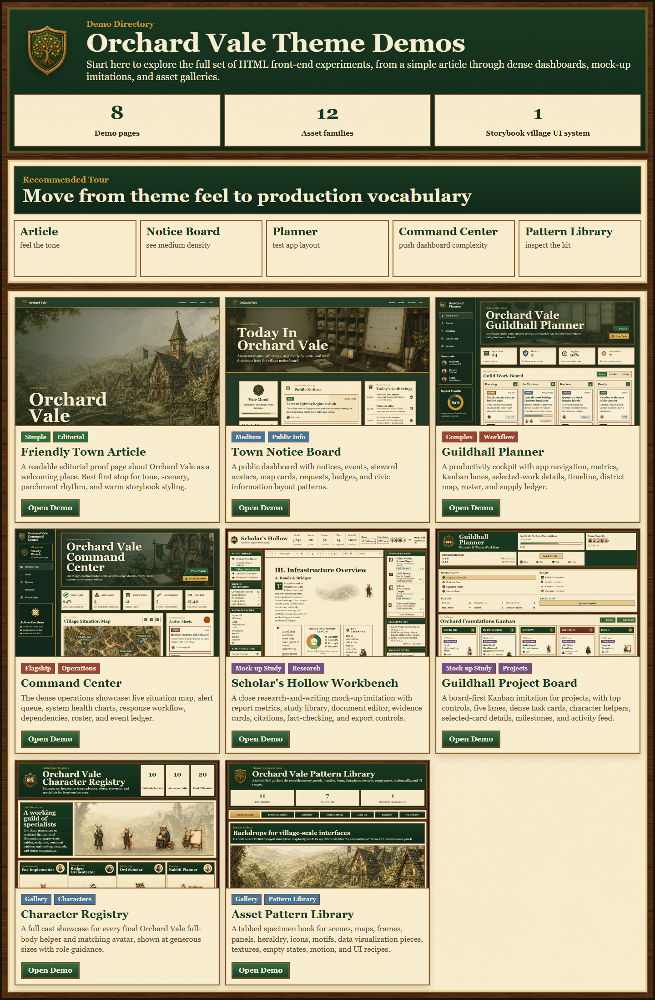
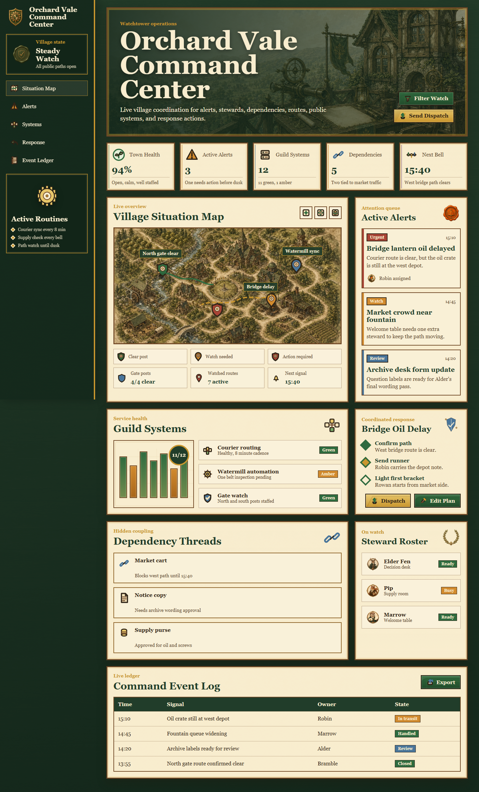
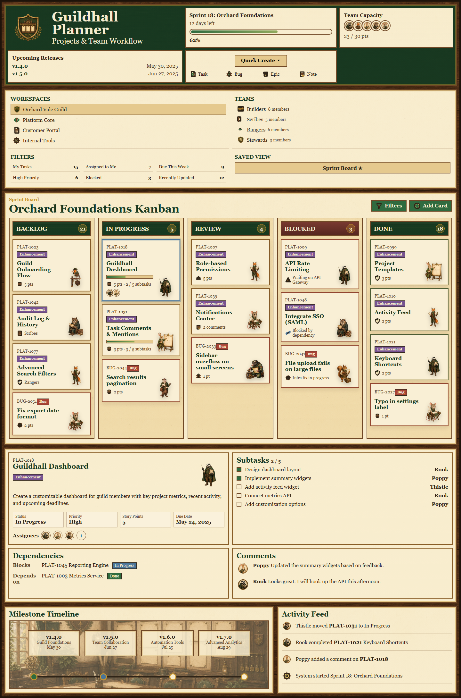
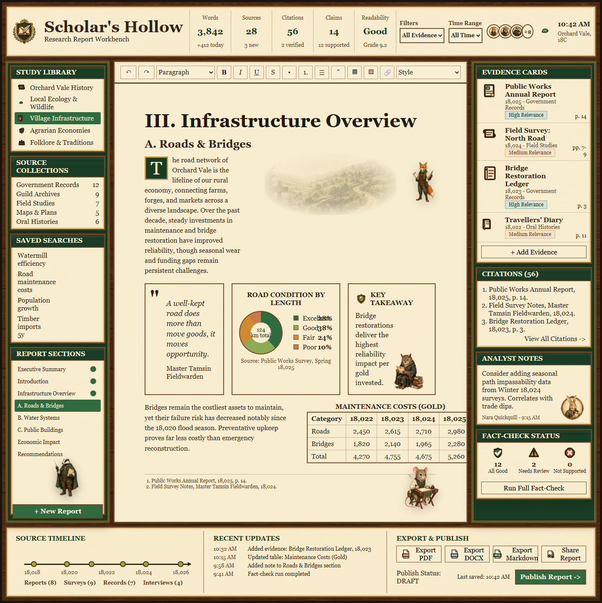
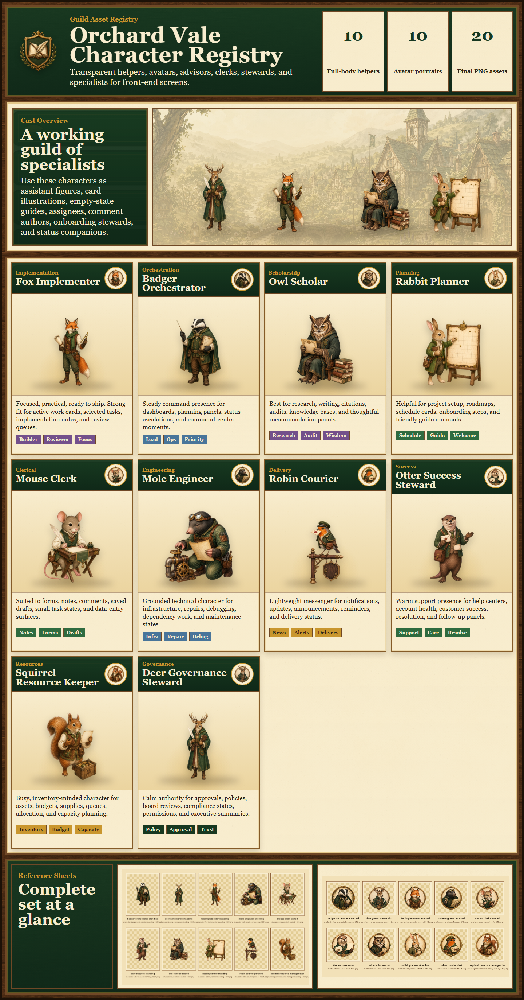

# Orchard Vale Theme Kit

Welcome to Orchard Vale!!

Orchard Vale is a richly illustrated storybook-village UI theme for HTML front-ends. It blends practical SaaS/product interface patterns with parchment panels, carved wood frames, dark forest-green headers, brass trim, heraldry, illustrated maps, guild-like dashboards, and a cast of woodland helpers.

The goal is not to make a generic fantasy skin. The goal is to make serious interfaces feel handcrafted, warm, readable, and distinctive.

[Open the demo index locally](demo/index.html) to tour the full set.



## Highlights

- Static HTML/CSS demos with no build step.
- Complete asset pack for scenes, maps, characters, crests, seals, icons, motifs, ornaments, textures, data-viz accents, empty states, and motion stills.
- Design documentation explaining the Orchard Vale visual language and how to apply it to front-end layouts.
- Progressive demos ranging from a simple editorial page to dense dashboards and mock-up imitations.
- A tabbed pattern library for browsing and inspecting reusable theme assets.

## Demo Tour

Start with [demo/index.html](demo/index.html). It explains every demo and links to each page.

| Demo | Purpose |
| --- | --- |
| [Friendly Town Article](demo/friendly-town.html) | A simple editorial proof page for tone, scenery, parchment rhythm, and warm storybook styling. |
| [Town Notice Board](demo/town-notice-board.html) | A medium-density public information board with notices, events, map cards, steward avatars, and badges. |
| [Guildhall Planner](demo/guildhall-planner.html) | A complex workflow dashboard with navigation, metrics, Kanban lanes, selected-work details, timeline, roster, and map. |
| [Command Center](demo/command-center.html) | A flagship operations dashboard with situation map, alerts, system health, response workflow, dependencies, and event ledger. |
| [Scholar's Hollow Workbench](demo/scholars-hollow-workbench.html) | A research-and-writing mock-up imitation with document editing, evidence cards, citations, fact-check status, and export controls. |
| [Guildhall Project Board](demo/guildhall-project-board.html) | A project-board mock-up imitation with five-lane Kanban, dense task cards, character helpers, details, milestones, and activity feed. |
| [Character Registry](demo/character-gallery.html) | A large-format gallery of every final full-body character and matching avatar. |
| [Asset Pattern Library](demo/asset-pattern-library.html) | A tabbed specimen book for all non-character asset families and composed UI recipes. |

## Screenshots

### Operations Dashboard



### Project Board



### Research Workbench



### Character Registry



### Pattern Library


## Asset Families

The reusable assets live under [src/assets/orchard-vale](src/assets/orchard-vale).

| Family | Use |
| --- | --- |
| [Scenes](src/assets/orchard-vale/scenes) | Wide and ultrawide illustrated backdrops for app shells, hero areas, workbenches, and dashboards. |
| [Maps](src/assets/orchard-vale/maps) | Village and district maps, route maps, pins, markers, controls, scale plaques, and compass assets. |
| [Characters](src/assets/orchard-vale/characters) | Full-body helpers and matching avatars for rosters, comments, empty states, side panels, and contextual guidance. |
| [Heraldry](src/assets/orchard-vale/heraldry) | Crests, seals, shield frames, approval marks, review marks, and app identity assets. |
| [Icons](src/assets/orchard-vale/icons) | 32px practical UI icons for actions, navigation, status, data, finance, infrastructure, exports, and workflow. |
| [Motifs](src/assets/orchard-vale/motifs) | 96px domain symbols for AI, CRM, finance, operations, productivity, project, and research screens. |
| [Backplates](src/assets/orchard-vale/backplates) | Buttons, fields, ribbons, labels, badges, tabs, and reusable component surfaces. |
| [Ornaments](src/assets/orchard-vale/ornaments) | Corners, dividers, hinges, rivets, frames, scroll caps, ribbon tails, and flourishes. |
| [Data Viz](src/assets/orchard-vale/data-viz) | Chart frames, meters, ledger rules, timeline plaques, tooltips, callouts, and category symbols. |
| [Textures](src/assets/orchard-vale/textures) | Parchment, green signboard, carved wood, walnut, brass, watercolor wash, and ink overlays. |
| [Empty States](src/assets/orchard-vale/empty-states) | Larger illustrated empty-state art and small spot illustrations. |
| [Motion](src/assets/orchard-vale/motion) | Static previews and spritesheets for small theme animations. |

The most useful browsing pages are:

- [Character Registry](demo/character-gallery.html)
- [Asset Pattern Library](demo/asset-pattern-library.html)
- [Asset Inventory](docs/asset-inventory.md)
- [Asset Generation Plan](docs/asset-generation-plan.md)
- [GitHub Publishing Checklist](docs/github-publishing-checklist.md)

## Design Guide

The canonical design documentation is [docs/design.md](docs/design.md).

It covers:

- The Orchard Vale aesthetic model.
- Color, typography, layout, density, and accessibility guidance.
- How to use storybook illustration without sacrificing product readability.
- How to translate image-generation mock-ups into real HTML/CSS front-ends.

## Using The Kit

This repository is intentionally simple. You can open any demo HTML file directly in a browser.

```text
demo/index.html
```

For a new page:

1. Start with one of the demo pages closest to your target layout.
2. Reuse assets from [src/assets/orchard-vale](src/assets/orchard-vale).
3. Use the design guide as the visual contract.
4. Keep real interface controls as HTML/CSS. Use images for atmosphere, identity, ornament, maps, helpers, and empty states.

The files in [src/theme](src/theme) contain early foundation tokens and placeholders. The demos currently show the most complete application of the theme.

## Suggested GitHub Pages Setup

After publishing the repository, enable GitHub Pages for the repo and point it at the root of the default branch. The main entry point is:

```text
demo/index.html
```

If you prefer the demo index to appear at the root URL, you can later copy or redirect `demo/index.html` to a root-level `index.html`.

## Repository Structure

```text
docs/
  design.md
  asset-generation-plan.md
  asset-inventory.md
references/
  Original reference mock-ups used to develop the visual language.
src/
  assets/orchard-vale/
    Reusable image, SVG, texture, map, character, and UI assets.
  theme/
    Starter CSS tokens and theme foundations.
demo/
  index.html
  *.html
  screenshots/
```

## Contributing

See [CONTRIBUTING.md](CONTRIBUTING.md) for the design principles and validation checklist for adding demos or assets.

## Notes On Generated Assets

This kit was built as an original Orchard Vale theme exploration with AI-assisted image generation and hand-authored HTML/CSS composition. The assets are intended to be used as a cohesive visual system rather than copied one-off decorations.

## License

MIT. See [LICENSE](LICENSE).
