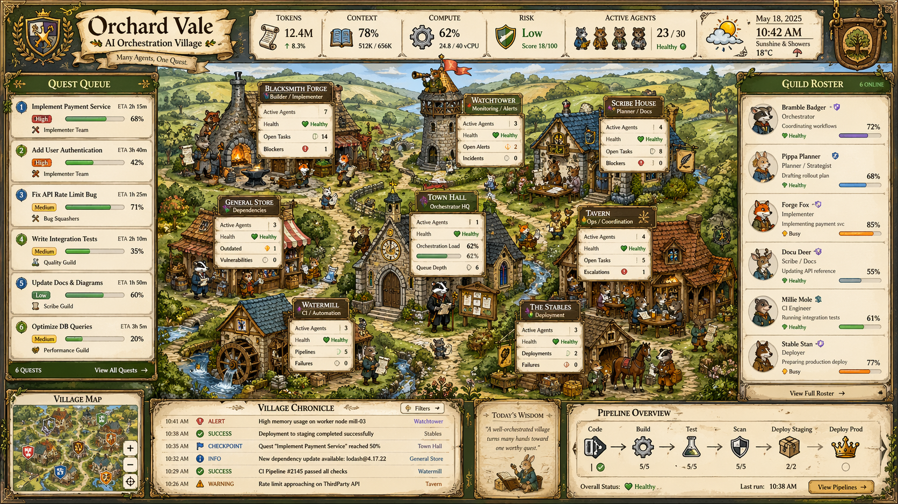

# Orchard Vale Design Guide

This guide describes the `agent-dashboard-orchard-vale.png` dashboard as a reproducible interface system. The goal is a pixel-faithful recreation of the screenshot: a dense fantasy village operations dashboard where modern AI orchestration concepts are expressed as quests, guild members, village buildings, chronicles, and pipelines.



## Source Frame

- Source image: `agent-dashboard-orchard-vale.png`
- Native canvas: `1672 x 941`
- Aspect ratio: `1.777`, close to 16:9
- Composition model: framed dashboard over an illustrated village scene
- Visual density: high; almost every region carries useful operational information
- Primary metaphor: an AI orchestration village management game

All measurements below are based on the native `1672 x 941` canvas. When scaling, preserve proportions first, then preserve minimum text sizes for readability.

## Layout Blueprint

The screen is built from five major zones:

| Zone | Native Bounds | Purpose |
|---|---:|---|
| Outer carved frame | `0,0 1672x941` | Dark wood/brass fantasy container |
| Top command strip | `0,0 1672x133` | Brand, metrics, date/weather, crest |
| Left quest rail | `14,137 286x574` | Current work queue |
| Center village map | `300,119 1078x628` | Main orchestration tableau |
| Right guild rail | `1378,137 280x613` | Active agent roster |
| Bottom status band | `14,748 1644x183` | Map, chronicle, wisdom, pipeline |

Use a single fixed artboard for exact recreation. For responsive implementations, keep the central village first, then stack the quest rail, roster, and bottom modules below it.

```css
:root {
  --ov-canvas-w: 1672px;
  --ov-canvas-h: 941px;
  --ov-top-h: 133px;
  --ov-left-w: 286px;
  --ov-right-w: 280px;
  --ov-bottom-h: 183px;
  --ov-gutter: 8px;
}
```

## Visual Thesis

The interface should feel like a hand-illustrated management sim rather than a flat dashboard. Every data panel appears nailed, carved, hung, or pasted into a medieval village scene. The style balances charming illustration with serious operational density: progress bars, status values, tables, alerts, and pipeline states must remain scannable.

The design succeeds because modern concepts are never named generically when a village metaphor can carry them:

- Tasks become quests.
- Agents become guild members.
- Services become village buildings.
- Logs become chronicles.
- CI/CD becomes a pipeline procession.
- Health/risk become village safety signals.

## Prompt Evaluation

The supplied image-generation prompt captures the broader Orchard Vale identity well. Its strongest parts are the mood, material palette, UI language, and quality bar. It correctly frames the style as a serious product interface with storybook village craft, not as a fantasy scene with UI decorations pasted on top.

What the prompt does well:

- It names the hybrid clearly: modern product UI plus old-English village illustration.
- It keeps the mood adult and useful: warm, practical, readable, handcrafted, not childish.
- It lists the right material system: parchment, green headers, brass trim, carved wood, crests, banners, ink-and-watercolor texture.
- It pushes for real widgets and information hierarchy rather than pure decoration.
- It correctly warns against generic tavern scenes, flat minimalism, sci-fi styling, unreadable text, and copied game UI.
- It allows layout variation, which is important when applying Orchard Vale to many app types.

Where the prompt needs tightening:

- It is good for concept art, but too broad for implementation. A frontend needs tokens, component rules, layout recipes, states, and asset boundaries.
- It asks for many possible widgets at once. For actual screens, choose only the widgets the workflow needs.
- It says "do not default to the same layout every time", which is right for theme exploration but wrong for pixel-perfect recreation of the original dashboard. Use a mode switch: exact screenshot recreation or Orchard Vale adaptation.
- It relies on the image model to invent legible UI text. For production mockups, provide exact labels, values, row data, and hierarchy.
- It names many illustrative motifs. In HTML, most of those should become a small asset library, not one-off decorations scattered across every component.
- It should explicitly say that functional UI panels must be rendered as real HTML/CSS, while generated art should be reserved for backgrounds, crests, avatars, textures, and empty-state illustrations.

Recommended prompt contract:

```text
Use Orchard Vale as a product UI theme, not a scene prompt. Build a serious desktop app screen with real information architecture first, then express it through parchment surfaces, carved wood framing, brass trim, dark green section ribbons, hand-inked icons, countryside illustration accents, and small guild-character avatars. Text labels must be meaningful and legible. Decoration must reinforce the workflow, not compete with it.
```

Use the supplied prompt when generating visual references. Use this design guide when implementing actual frontends.

## Theme Modes

Orchard Vale has two valid modes. Choose one before designing a screen.

### Pixel-Faithful Dashboard Mode

Use this when recreating `agent-dashboard-orchard-vale.png`.

- Preserve the 16:9 dashboard shell.
- Keep the top metrics, left quest rail, center village, right roster, and bottom chronicle/pipeline band.
- Use the exact text, values, building names, and panel proportions from this guide.
- Treat the village tableau as the primary composition.

### Adaptive Product Theme Mode

Use this when applying Orchard Vale to a different HTML frontend.

- Keep the material system, typography, status language, and metaphor vocabulary.
- Change the layout to fit the actual product workflow.
- Do not force a village map into every screen.
- Replace generic UI nouns with domain-appropriate village terms only where it improves clarity.
- Use illustration as framing and context, while preserving conventional product ergonomics.

In adaptive mode, the Orchard Vale essence is not "always a village map." It is a warm, crafted, operational product interface where data and workflows feel like guild work recorded on ledgers, notices, maps, and workshop boards.

## Reference Library

The theme kit includes five reference images:

| Reference | File | App Type | Primary Lesson |
|---|---|---|---|
| Orchard Vale | `../references/orchard-vale-dashboard.png` | AI orchestration command center | Full village-map dashboard shell |
| Scholar's Hollow | `../references/scholars-hollow-workbench.png` | Research report workbench | Document editor plus evidence/citation rails |
| Prosperity Grove | `../references/prosperity-grove-ledger.png` | Household finance ledger | Charts, ledgers, goals, bills, and advisor panels |
| Hearthside Commons | `../references/hearthside-commons-productivity.png` | Mail, calendar, and tasks | Conventional productivity layout translated into parchment UI |
| Guildhall Planner | `../references/guildhall-planner-board.png` | Project and team workflow | Kanban board, detail drawer, milestone timeline, quick create |

These references prove that Orchard Vale is a design language, not one screen. The shared identity comes from materials, typography, icon style, dense useful panels, and guild/village metaphors. The layout should change with the product.

## Multi-App Design Cues

### Scholar's Hollow: Research Report Workbench

This reference shows how Orchard Vale handles a serious editor interface.

Reusable cues:

- The central workspace can be a clean parchment document, not a village scene.
- Rich text toolbars can remain conventional, but should sit on parchment with brass dividers and compact icon buttons.
- Evidence, citations, analyst notes, and fact-check status work well as right-side stacked panels.
- Left navigation can become a study library with source collections, saved searches, and report sections.
- Embedded figures, quotes, charts, key takeaways, and side illustrations can live inside the document body.
- Export/publish workflows can sit in a bottom band with large practical buttons.

Frontend implication: use Orchard Vale for editor chrome and support panels, but keep the actual writing surface calm, spacious, and highly legible.

### Prosperity Grove: Household Finance Ledger

This reference shows the theme working as a chart-heavy financial dashboard.

Reusable cues:

- A top metric strip works across domains when values are rendered as resource counters.
- Charts should remain real charts, framed by parchment and brass, rather than fantasy illustrations pretending to be charts.
- Accounts, bills, goals, and transactions map naturally to ledgers and household records.
- Advisor panels give the theme a human/character voice without interrupting the data.
- A scenic illustration panel can occupy secondary space, but it should not replace useful financial content.
- Green action buttons with brass borders are effective CTAs.

Frontend implication: financial and analytics screens should keep standard chart/table ergonomics, using Orchard Vale materials as framing and hierarchy.

### Hearthside Commons: Mail, Calendar, And Tasks

This reference shows the theme applied to a productivity suite.

Reusable cues:

- Familiar app structure still works: folder nav, message list, message reader, calendar grid, task columns, activity log.
- Selection states can use green parchment highlights and small status dots.
- Top actions can be icon-led commands on parchment tiles.
- Calendar events can use muted category colors inside ruled parchment cells.
- Attachments can become small document tiles with file-type badges.
- Bottom activity logs can become horizontal chronicle cards.

Frontend implication: do not rename everything into fantasy language if the standard product noun is clearer. Mail can still be mail; the theme comes through surfaces, avatars, crests, and crafted controls.

### Guildhall Planner: Projects And Team Workflow

This reference shows the strongest adaptive pattern for kanban and project management.

Reusable cues:

- Kanban columns become guild boards with ornate green headers, status icons, and count badges.
- Cards can use parchment surfaces, small character art, status chips, story points, subtasks, and assignee portraits.
- The right-side detail pane is a strong pattern for selected work items.
- Sprint capacity, release dates, and quick create controls fit naturally in the top command bar.
- Bottom timeline and activity feed modules keep long-running project context visible.
- Blocked or high-risk cards can use red borders without making the whole board feel alarming.

Frontend implication: project apps should lean on real drag/drop board behavior and use ornament at the column, card, and detail-panel level.

## Cross-Reference Patterns

Across all references, the repeated Orchard Vale grammar is:

- A carved dark wood outer shell or at least a dark green/wood command frame.
- Large parchment title banner with crest, subtitle, and small leaf ornaments.
- Top command strip with metrics, filters, active collaborators, user profile, or quick actions.
- Parchment panels with low-radius corners, dark ink borders, brass inner lines, and subtle texture.
- Dark moss-green section headers with gold ornaments.
- Dense but readable rows, charts, cards, calendars, and tables.
- Small hand-drawn animal guild characters used as avatars, advisors, or contextual helpers.
- Bottom chronicle/timeline/activity bands for recent events and history.
- Status colors used consistently: green healthy/done, amber warning/medium, red urgent/blocked, blue/purple category/selection.
- Real product controls presented as crafted objects, not replaced by decorative images.

The most important transferable cue is hierarchy: ornate shell, readable work surface, compact operational panels, and illustration as support.

## Palette

The image uses warm parchment and dark wood as the base, forest green for headers, brass/gold for trim, and small saturated accents for state.

```css
:root {
  --ov-ink: #1b1208;
  --ov-ink-soft: #3b2714;
  --ov-parchment: #f4e6c5;
  --ov-parchment-warm: #ead2a3;
  --ov-parchment-aged: #c9a866;
  --ov-paper-shadow: #8b6530;

  --ov-wood-dark: #181006;
  --ov-wood: #2b1a0b;
  --ov-wood-light: #563316;
  --ov-brass: #c7942f;
  --ov-brass-light: #e0bd62;
  --ov-brass-dark: #6c4215;

  --ov-green-black: #102812;
  --ov-green: #204f1d;
  --ov-green-light: #69a646;
  --ov-blue: #245f99;
  --ov-sky: #8fc2d9;
  --ov-red: #b12d22;
  --ov-orange: #d97a24;
  --ov-gold: #d7a927;
  --ov-purple: #7d4fa6;
  --ov-gray-blue: #7891a0;
}
```

Approximate usage:

- Parchment panels: `--ov-parchment`, shaded with `--ov-parchment-aged`
- Outer frame: `--ov-wood-dark`, `--ov-wood`, `--ov-brass`
- Section headers: `--ov-green-black` to `--ov-green`
- Progress success: `--ov-green-light`
- Warning/busy: `--ov-gold` or `--ov-orange`
- Error/high risk: `--ov-red`
- Informational/checkpoint: `--ov-blue`
- Decorative role accents: `--ov-purple`

Avoid modern gradients, glass effects, neon, and large flat fills. Color should feel painted, printed, or enamelled.

## Typography

The screenshot uses a storybook serif for major headings and compact readable text for operational content.

Recommended stacks:

```css
:root {
  --ov-display: "IM Fell English SC", "Cinzel Decorative", Georgia, serif;
  --ov-serif: "IM Fell English", Georgia, serif;
  --ov-ui: "Arial Narrow", "Trebuchet MS", Arial, sans-serif;
  --ov-mono: "IBM Plex Mono", Consolas, monospace;
}
```

Type scale at native resolution:

| Use | Size | Weight/Style | Notes |
|---|---:|---|---|
| Main title `Orchard Vale` | `46-52px` | bold serif | Black ink, slight shadow |
| Section title | `20-24px` | small-caps serif | Cream text on green ribbon |
| Metric value | `24-30px` | bold serif or UI | Large enough to scan |
| Metric label | `14-16px` | uppercase serif | Centered above value |
| Quest title | `13-15px` | bold UI | Dense but readable |
| Body labels | `11-13px` | UI | Use short lines |
| Log rows | `11-12px` | UI/mono | Compact table rhythm |

Use dark ink on parchment. Use pale cream text on dark green headers. Do not set long paragraphs in display type.

## Framing And Materials

### Outer Frame

The outer frame is a carved dark wood border with brass edging and ornamental corners.

Implementation rules:

- Base fill: dark brown/black wood.
- Add a thin black outer stroke.
- Add 2-3 inner strokes: brass, dark brown, muted gold.
- Corners should feel reinforced with decorative metalwork or vinework.
- The top-left and top-right corners carry heraldic badges.
- The right edge has a vertical brass chain detail.

CSS approximation:

```css
.ov-frame {
  width: 1672px;
  height: 941px;
  color: var(--ov-ink);
  background:
    linear-gradient(90deg, rgba(255,255,255,.05), transparent 18%, rgba(0,0,0,.25)),
    repeating-linear-gradient(90deg, #201208 0 8px, #2c190a 8px 18px);
  border: 4px solid #0d0804;
  box-shadow:
    inset 0 0 0 2px var(--ov-brass-dark),
    inset 0 0 0 5px var(--ov-brass),
    inset 0 0 24px rgba(0,0,0,.75);
}
```

### Parchment Panels

Parchment is warm, irregular, and slightly stained. It should never look like a pure white card.

Rules:

- Use uneven tan backgrounds.
- Add dark brown 2px borders.
- Add inner brass hairlines.
- Add subtle noise, scratches, or painted stain shapes.
- Use tiny flourishes in corners where possible.
- Keep radius low: `3-7px`.

```css
.ov-parchment {
  background:
    radial-gradient(circle at 20% 15%, rgba(255,255,255,.32), transparent 22%),
    radial-gradient(circle at 80% 80%, rgba(125,78,25,.16), transparent 26%),
    linear-gradient(#f6e9cb, #ead0a0);
  border: 2px solid var(--ov-wood);
  border-radius: 6px;
  box-shadow:
    inset 0 0 0 1px rgba(199,148,47,.75),
    inset 0 0 18px rgba(121,78,27,.24),
    0 3px 0 rgba(30,18,7,.65);
}
```

### Green Ribbon Headers

Section headers use a dark green plaque/ribbon, brass border, cream serif label, and small gold ornament marks.

```css
.ov-ribbon {
  min-height: 36px;
  color: #f8e9b5;
  background: linear-gradient(#2b641f, #153915);
  border: 2px solid var(--ov-brass-dark);
  box-shadow:
    inset 0 0 0 1px var(--ov-brass),
    inset 0 6px 0 rgba(255,255,255,.06),
    0 2px 0 rgba(0,0,0,.55);
  font-family: var(--ov-display);
  text-shadow: 1px 1px 0 #120b05;
}
```

## Top Command Strip

The top strip combines a large identity banner with six operational metric cards and a weather/date module.

Native layout:

- Left crest block: `16,17 118x101`
- Brand banner: `131,17 323x109`
- Metric cards: start around `465,18`; each roughly `145-160px` wide
- Weather/date card: `1308,21 220x91`
- Orchard crest: `1534,16 112x107`

### Brand Block

Content:

- Title: `Orchard Vale`
- Subtitle: `AI Orchestration Village`
- Motto ribbon: `Many Agents, One Quest.`

Treatment:

- Title sits on a torn parchment banner.
- Tiny leaf/bee ornaments flank subtitle.
- Motto uses a smaller scroll banner below.
- Left crest is shield + crown + laurel.

### Metric Cards

Cards use parchment rectangles with small illustrated icons. Each card has a centered label, large value, and lower detail line.

Exact metric content:

| Label | Value | Detail |
|---|---:|---|
| Tokens | `12.4M` | `up 8.3%` |
| Context | `78%` | `512K / 656K` |
| Compute | `62%` | `248 / 40 vCPU` |
| Risk | `Low` | `Score 18/100` |
| Active Agents | `23 / 30` | `Healthy` |
| Weather/Date | `May 18, 2025`, `10:42 AM` | `Sunshine & Showers`, `18 deg C` |

Metric card rules:

- Label in uppercase/small caps at top.
- Icon left or center-left.
- Value large, black or green.
- Use vertical dividers between cards.
- Add tiny ornamental corner strokes.

## Center Village Tableau

The central village is the emotional and functional core. It should be one continuous illustrated landscape, not a grid of cards. Buildings act as service nodes, each with a parchment status callout attached or nearby.

Native bounds:

- Map area: approximately `300,119 1078x628`
- Horizon begins near `y=120`
- Main roads converge around Town Hall at center-lower area
- Buildings are distributed across the map, each with a dark label plaque and parchment details

Required building/service mapping:

| Building | Role | Approx Position |
|---|---|---:|
| Blacksmith Forge | Builder / Implementer | `485,155` |
| Watchtower | Monitoring / Alerts | `867,175` |
| Scribe House | Planner / Docs | `1125,182` |
| General Store | Dependencies | `406,374` |
| Town Hall | Orchestrator HQ | `765,361` |
| Tavern | Ops / Coordination | `1082,391` |
| Watermill | CI / Automation | `548,567` |
| The Stables | Deployment | `964,574` |

### Building Callouts

Each callout has:

- Dark wood title plaque
- White or cream serif building name
- Purple role marker or small icon
- Parchment detail table below
- 3-4 rows of status facts
- Tiny status icons and numeric values aligned right

Example structure:

```html
<section class="ov-building-card">
  <header>
    <h3>Blacksmith Forge</h3>
    <p>Builder / Implementer</p>
  </header>
  <dl>
    <div><dt>Active Agents</dt><dd>7</dd></div>
    <div><dt>Health</dt><dd class="healthy">Healthy</dd></div>
    <div><dt>Open Tasks</dt><dd>14</dd></div>
    <div><dt>Blockers</dt><dd>1</dd></div>
  </dl>
</section>
```

Callout style:

- Width: `125-150px`
- Header height: `34-42px`
- Detail row height: `22-26px`
- Border: `2px` dark wood, inner brass line
- Header background: dark brown, not green
- Use small color icons: green heart, yellow warning, red blocker, gray ring

### Village Illustration Rules

To match the screenshot, the central art needs these elements:

- Rolling green hills and river in background.
- Light blue sky with soft clouds.
- Dense village buildings with stone, timber, thatch, and tile roofs.
- Curving road network connecting all services.
- Small animal-like guild workers throughout the scene.
- Flags, signposts, market stalls, carts, flowers, crates, and tools.
- A river/waterfall and watermill at bottom-left.
- Town Hall/church tower centered low.
- Watchtower centered high.
- Tavern and stables lower-right.

The central image should stay bright and storybook-like. Do not darken it behind overlays; instead make overlays opaque enough to read.

## Left Quest Queue

Native bounds:

- Full rail: `14,137 286x574`
- Header: `21,143 270x38`
- Quest rows: six rows, each about `84-88px` tall
- Footer: `22,674 264x32`

Header text: `Quest Queue`

Each quest row contains:

- Circular rank badge at left
- Quest title
- ETA at top-right
- Priority chip
- Progress bar and percent
- Team/guild line with small icon

Exact queue:

| # | Quest | ETA | Priority | Progress | Guild |
|---:|---|---|---|---:|---|
| 1 | Implement Payment Service | `2h 15m` | High | `68%` | Implementer Team |
| 2 | Add User Authentication | `3h 40m` | High | `42%` | Implementer Team |
| 3 | Fix API Rate Limit Bug | `1h 25m` | Medium | `71%` | Bug Squashers |
| 4 | Write Integration Tests | `2h 10m` | Medium | `35%` | Quality Guild |
| 5 | Update Docs & Diagrams | `1h 50m` | Low | `60%` | Scribe Guild |
| 6 | Optimize DB Queries | `3h 5m` | Medium | `20%` | Performance Guild |

Footer:

- Left: `6 Quests`
- Right action: `View All Quests ->`

Row rules:

- Rows are parchment, separated by dark horizontal dividers.
- Rank badges are jewel-toned circles: blue, green, blue, green, blue, green.
- Priority chips are rounded pill labels with red/orange/green fills.
- Progress bars use muted gray tracks with green fills.
- Percent value sits right of the bar.

## Right Guild Roster

Native bounds:

- Full rail: `1378,137 280x613`
- Header: `1384,143 266x38`
- Roster rows: six rows, each about `85-88px` tall
- Footer action: `View Full Roster ->`

Header:

- Title: `Guild Roster`
- Online count: `6 Online`

Roster entries:

| Agent | Role | Activity | Status | Load |
|---|---|---|---|---:|
| Bramble Badger | Orchestrator | Coordinating workflows | Healthy | `72%` |
| Pippa Planner | Planner / Strategist | Drafting rollout plan | Healthy | `68%` |
| Forge Fox | Implementer | Implementing payment svc | Busy | `85%` |
| Docu Deer | Scribe / Docs | Updating API reference | Healthy | `55%` |
| Millie Mole | CI Engineer | Running integration tests | Healthy | `61%` |
| Stable Stan | Deployer | Preparing production deploy | Busy | `77%` |

Roster row rules:

- Circular avatar medallion on the left.
- Name bold and slightly larger than details.
- Small role badge icon near name.
- Status line with green heart or yellow busy icon.
- Horizontal progress bar on the right/lower area.
- Keep each row divided by thin brown lines.

Avatars should look like small heraldic character portraits on parchment, not modern profile photos.

## Bottom Status Band

The bottom band is a dashboard within the dashboard. It contains four modules:

| Module | Native Bounds | Purpose |
|---|---:|---|
| Village Map | `17,725 269x202` | Mini-map and map controls |
| Village Chronicle | `295,752 559x176` | Activity log table |
| Today's Wisdom | `879,760 151x168` | Quote card |
| Pipeline Overview | `1047,759 595x168` | CI/CD pipeline state |

### Village Map

Header: `Village Map`

Content:

- Mini illustrated map image.
- Colored shield markers placed over the map.
- Right-side vertical controls: plus, minus, target/crosshair.

Style:

- Same parchment frame as other panels.
- Mini-map should feel like a painted map of the central village.
- Controls are square parchment buttons with dark borders.

### Village Chronicle

Header: `Village Chronicle`

Right control: `Filters +`

Rows:

| Time | Type | Message | Source |
|---|---|---|---|
| `10:41 AM` | Alert | High memory usage on worker node mill-03 | Watchtower |
| `10:38 AM` | Success | Deployment to staging completed successfully | Stables |
| `10:35 AM` | Checkpoint | Quest "Implement Payment Service" reached 50% | Town Hall |
| `10:32 AM` | Info | New dependency update available: lodash@4.17.22 | General Store |
| `10:29 AM` | Success | CI Pipeline #2145 passed all checks | Watermill |
| `10:26 AM` | Warning | Rate limit approaching on ThirdParty API | Tavern |

Type colors:

- Alert: red shield/circle
- Success: green check
- Checkpoint: blue flag
- Info: blue information glyph
- Warning: yellow triangle

Chronicle rules:

- Rows are compact, around `22-24px`.
- Time column is narrow.
- Type column uses uppercase label and icon.
- Source is right-aligned and colored like a link.

### Today's Wisdom

Content:

`"A well-orchestrated village turns many hands toward one worthy quest."`

Visual:

- Small title at top.
- Decorative divider.
- Center illustration of a seated character reading/writing.
- Quote in italic serif.

### Pipeline Overview

Header: `Pipeline Overview`

Pipeline stages:

1. Code
2. Build
3. Test
4. Scan
5. Deploy Staging
6. Deploy Prod

Stage details:

- Code: icon + green check
- Build: gear icon, `5/5`
- Test: flask icon, `5/5`
- Scan: shield icon, `5/5`
- Deploy Staging: crate icon, `2/2`
- Deploy Prod: crown icon, empty pending circle

Footer:

- `Overall Status: Healthy`
- `Last run: 10:38 AM`
- Button: `View Pipelines ->`

Rules:

- Use large illustrated stage icons.
- Connect stages with simple black arrows.
- Place completion markers below icons.
- Button uses gold fill, dark border, and inset highlight.

## Iconography

Icon style is illustrated, outlined, and slightly irregular. Avoid thin-line modern icons unless redrawn into a painted badge style.

Required icon families:

- Heraldry: shields, crowns, laurels, banners.
- Metrics: scroll, book, gear, shield, agent portraits, weather.
- Status: heart, warning diamond, red exclamation, check, flag, info.
- Pipeline: code braces, gear, flask, shield, crate, crown.
- Controls: plus, minus, target, filter, arrows.

Icons should use dark ink outlines and two or three flat fills. Shadows should be painted/inset, not glossy.

## Progress And Status Components

Progress bars:

```css
.ov-progress {
  height: 8px;
  background: #d5c5a3;
  border: 1px solid #8a6c3a;
  border-radius: 8px;
  box-shadow: inset 0 1px 2px rgba(0,0,0,.28);
}

.ov-progress > span {
  display: block;
  height: 100%;
  border-radius: inherit;
  background: linear-gradient(#7fbd5b, #3f8b34);
  box-shadow: inset 0 1px 0 rgba(255,255,255,.35);
}
```

Status language:

- Healthy: green heart + `Healthy`
- Busy: yellow/orange marker + `Busy`
- Low risk: green shield + `Low`
- High priority: red chip + `High`
- Medium priority: amber chip + `Medium`
- Low priority: green chip + `Low`

## Decorative Details

Pixel-perfect feel depends on the small treatments:

- Torn parchment edges on the main title banner.
- Thin vines and leaf ornaments in corners.
- Brass tacks or rivets at panel corners.
- Dark drop shadows under every raised panel.
- Small ornamental separators around headings.
- Slightly uneven panel edges.
- Tiny illustrated props around buildings.
- Weather card ink splatters and doodles.
- Heraldic shields on both top corners.

Use decoration to frame content, not to replace content. Operational text must remain readable.

## Spatial Rhythm

At native size:

- Outer frame padding: `8-14px`
- Panel gap: `6-10px`
- Parchment card padding: `8-12px`
- Quest row internal padding: `8px`
- Roster row internal padding: `8-10px`
- Metric card padding: `8px`
- Building callout row gap: `3-5px`

Most panels use tight spacing. The design should feel full but not random: align rails, headers, and row dividers precisely.

## Implementation Skeleton

Use this structure for a faithful web recreation:

```html
<main class="ov-frame">
  <header class="ov-topbar">
    <section class="ov-crest ov-crest-left"></section>
    <section class="ov-brand"></section>
    <section class="ov-metrics"></section>
    <section class="ov-weather"></section>
    <section class="ov-crest ov-crest-right"></section>
  </header>

  <aside class="ov-quest-queue"></aside>

  <section class="ov-village">
    <article class="ov-building-card blacksmith"></article>
    <article class="ov-building-card watchtower"></article>
    <article class="ov-building-card scribe-house"></article>
    <article class="ov-building-card general-store"></article>
    <article class="ov-building-card town-hall"></article>
    <article class="ov-building-card tavern"></article>
    <article class="ov-building-card watermill"></article>
    <article class="ov-building-card stables"></article>
  </section>

  <aside class="ov-guild-roster"></aside>

  <footer class="ov-bottom-band">
    <section class="ov-mini-map"></section>
    <section class="ov-chronicle"></section>
    <section class="ov-wisdom"></section>
    <section class="ov-pipeline"></section>
  </footer>
</main>
```

Fixed layout CSS:

```css
.ov-frame {
  position: relative;
  width: 1672px;
  height: 941px;
  overflow: hidden;
}

.ov-topbar { position: absolute; left: 0; top: 0; width: 1672px; height: 133px; }
.ov-quest-queue { position: absolute; left: 14px; top: 137px; width: 286px; height: 574px; }
.ov-village { position: absolute; left: 300px; top: 119px; width: 1078px; height: 628px; }
.ov-guild-roster { position: absolute; left: 1378px; top: 137px; width: 280px; height: 613px; }
.ov-bottom-band { position: absolute; left: 14px; top: 748px; width: 1644px; height: 183px; }
```

## Applying Orchard Vale To HTML Frontends

Use the image prompt as art direction, then translate it into a frontend system with four layers:

1. Foundation: CSS tokens for color, type, spacing, borders, shadows, and surface textures.
2. Components: reusable panels, ribbons, tables, lists, tabs, buttons, badges, meters, avatars, notices, and toolbars.
3. Layout recipes: screen patterns for dashboards, editors, boards, timelines, CRMs, ledgers, and knowledge bases.
4. Art assets: generated or hand-made textures, crests, small character portraits, map backgrounds, icons, and decorative flourishes.

The core rule: do not generate a full app screenshot and use it as the UI. Generate supporting art assets, then build the working interface in HTML/CSS so text, controls, accessibility, responsiveness, and state changes remain real.

### Recommended Frontend Architecture

Create a small theme package before building one-off screens:

```text
src/
  theme/
    orchard-vale.css        # tokens, base surfaces, type, global utilities
    orchard-components.css  # panels, ribbons, buttons, forms, tables, badges
    orchard-layouts.css     # shell recipes and responsive layout rules
  assets/orchard-vale/
    parchment-noise.png
    wood-grain.png
    brass-corner.svg
    leaf-flourish.svg
    crest-default.svg
    avatars/
    icons/
    scenes/
```

Keep the theme portable. Product screens should import the theme and compose real app components; they should not duplicate ornamental CSS in every page.

### Component Translation

| Product UI Need | Orchard Vale Treatment | HTML Component |
|---|---|---|
| App shell | Carved wood frame or restrained wood top/side chrome | `.ov-app-shell` |
| Page heading | Parchment banner with small crest or leaf mark | `.ov-page-title` |
| Section header | Dark moss-green ribbon with brass inset border | `.ov-ribbon` |
| Card/panel | Aged parchment surface with ink border | `.ov-panel` |
| Table/log | Ledger or chronicle with ruled rows | `.ov-ledger-table` |
| Sidebar nav | Quest ledger, guild directory, or archive tabs | `.ov-side-rail` |
| Status badge | Wax seal, shield chip, or small parchment pill | `.ov-badge` |
| Progress | Brass-edged meter with painted fill | `.ov-progress` |
| User/avatar | Small heraldic portrait medallion | `.ov-avatar` |
| Primary button | Brass or green signboard button | `.ov-button--primary` |
| Secondary button | Parchment button with dark ink border | `.ov-button--secondary` |
| Empty state | Small illustrated helper beside a parchment note | `.ov-empty-state` |
| Modal/dialog | Posted notice or guild charter panel | `.ov-dialog` |

### Layout Recipes

Use the layout that fits the product. The theme should be recognizable through materials and components, not through one repeated dashboard composition.

#### Analytics Or Command Center

- Top metric strip becomes resource counters.
- Main region uses charts or maps inside parchment panels.
- Right rail shows alerts, recommendations, or active operators.
- Bottom strip can become a chronicle/event log.

#### Document Editor Or Report Workbench

- Center is a parchment document canvas with a practical editor toolbar.
- Left rail is an outline, sources list, or quest checklist.
- Right rail is review notes, approvals, citations, or helper avatars.
- Use subtle flourishes at panel edges, not inside the editable document body.

#### Kanban Or Project Board

- Columns become guild boards or workshop benches.
- Cards remain compact and draggable.
- Priority chips use the Orchard Vale status palette.
- Avoid over-decorating every card; let headers and empty states carry most of the theme.

#### CRM Or Contact Manager

- Contacts become roster entries.
- Deal stages become route markers, seals, or ledger tabs.
- Detail view uses a parchment dossier with activity chronicle.
- Use conventional search, filters, and table controls so the app stays fast to operate.

#### Financial Or Inventory Dashboard

- Metrics become ledgers, coin/resource counters, and stockroom shelves.
- Tables should be dense and highly readable.
- Charts can sit in framed parchment but should remain normal charts.
- Use brass dividers and green headers rather than decorative scene art in data-heavy regions.

### Asset Generation Strategy

Image generation is useful, but only for assets that can sit behind or beside real UI.

Good assets to generate:

- Seamless parchment texture, transparent PNG preferred.
- Dark carved wood frame texture.
- Brass corner caps, dividers, seals, and crest variations.
- Small avatar portraits in a consistent medallion crop.
- Empty village/countryside background scenes with no text.
- Mini-map backgrounds with no labels.
- Small contextual illustrations for empty states.

Avoid generating:

- Final UI text as part of an image.
- Buttons, forms, tables, or controls that users must interact with.
- Whole dashboards that will be used as static backgrounds.
- Charts with fake unreadable labels.

Prompt pattern for frontend assets:

```text
Create a single reusable UI asset for an Orchard Vale themed web app: [asset type].
Style: warm parchment, old-English storybook village craft, ink-and-watercolor texture, dark moss green, antique brass, walnut wood, crisp edges.
Requirements: transparent background where appropriate, no text, no UI labels, no full interface, clean silhouette, usable at [size].
```

### Implementation Priorities

Build the theme in this order:

1. Tokens: colors, type stacks, spacing, radii, shadows, z-index, and motion.
2. Surfaces: app background, wood frame, parchment panel, green ribbon, brass divider.
3. Controls: buttons, inputs, tabs, checkboxes, selects, filters, focus states.
4. Data display: progress bars, badges, metrics, tables, timelines, list rows.
5. Layout recipes: dashboard, editor, board, roster, ledger, timeline.
6. Art layer: textures, crests, avatars, icons, scene backgrounds.
7. Responsive behavior: container queries, rail stacking, scrollable dense regions.

Do not start with a beautiful background. Start with a plain working app, apply the surfaces, then add illustration last.

### Interaction And Accessibility

- Use real semantic controls for all buttons, links, inputs, menus, and tables.
- Keep body text at `13px` or larger in dense desktop UIs.
- Use visible focus rings in gold or blue.
- Keep contrast high on green ribbons and parchment panels.
- Add hover states through border, fill, or 1px lift; avoid bouncing or playful motion.
- Respect `prefers-reduced-motion`.
- Make decorative images `aria-hidden="true"` unless they carry information.
- Never put required text directly over busy illustration without a parchment backing.

### Frontend Quality Bar

An Orchard Vale frontend is successful when it feels themed before any illustration loads. If CSS tokens, panel shapes, typography, status language, and component structure already communicate the identity, then generated art can enhance it instead of carrying it.

## Responsive Translation

For smaller screens, do not shrink the whole dashboard until text becomes unreadable. Instead:

1. Top metrics become a horizontally scrollable strip.
2. Village tableau remains first and uses an aspect-ratio container.
3. Quest queue and guild roster stack as full-width panels.
4. Chronicle and pipeline become separate sections.
5. Mini-map and wisdom card move below the main operational modules.

Minimum practical sizes:

- Body text: `12px`
- Quest/roster rows: `72px`
- Building callouts: `120px` wide
- Central village: keep at least `640px` wide before switching to a simplified map.

## Quality Checklist

- The page reads immediately as `Orchard Vale`, not a generic fantasy dashboard.
- The first viewport contains the full command dashboard, not a landing-page hero.
- Left quest rail, center village, right roster, and bottom chronicle are all visible at native size.
- Every major number and label from the screenshot is represented.
- All panels use parchment, dark wood, brass, and green ribbon styling.
- Building callouts are anchored over a continuous village scene.
- The bottom pipeline uses icon stages connected by arrows.
- Progress bars and status chips use the same state colors throughout.
- Text remains readable over illustrated regions because labels sit on opaque parchment or plaques.
- The result feels hand-painted, operational, and dense.
